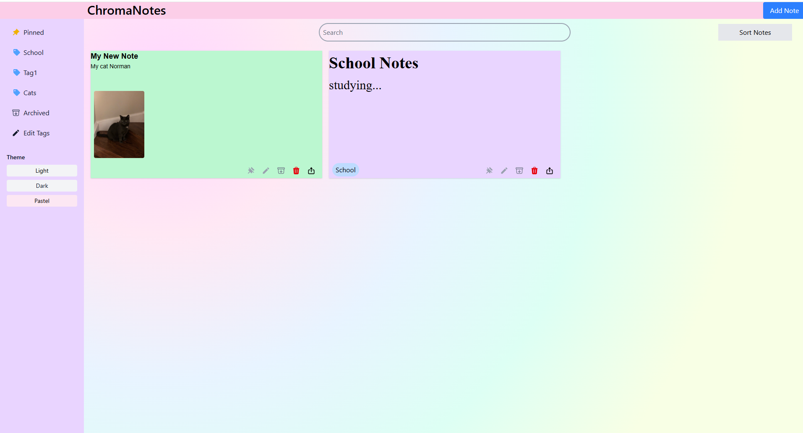
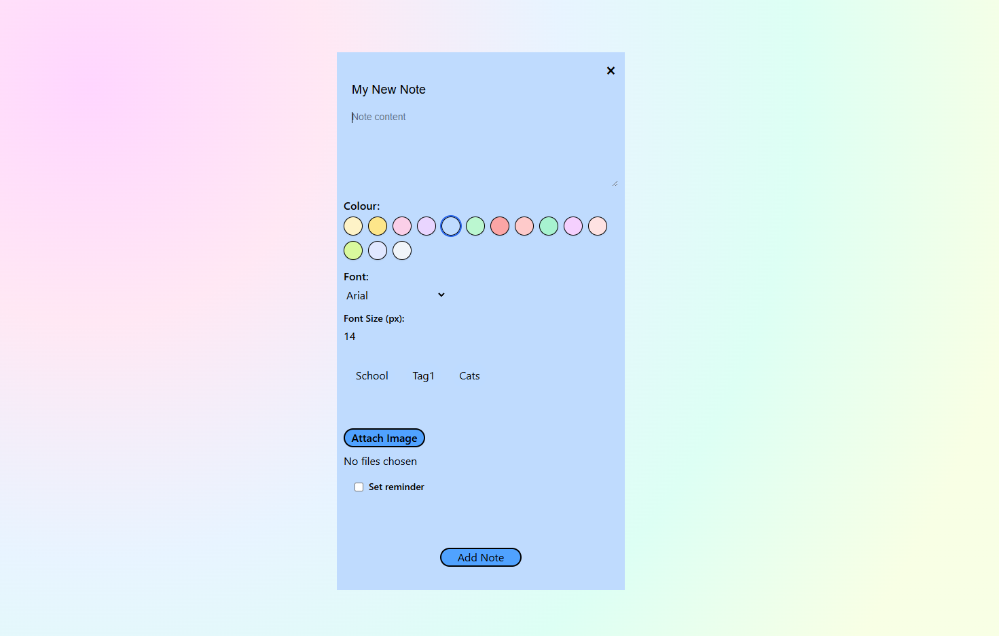

# ChromaNotes 🌈

ChromaNotes is a **colorful, intuitive web-based note-taking app** built with the **MERN stack**. Organize your ideas, tasks, and reminders with vibrant, color-coded notes that make staying productive both easy and fun.  



---

## Features ✨

- **Color-Coded Notes**: Assign colors to notes for easy organization and visual appeal.  
- **CRUD Functionality**: Create, read, update, and delete notes effortlessly.  
- **Responsive Design**: Works smoothly on desktops, tablets, and mobile devices.  
- **Search & Filter**: Quickly find notes by title, content, or color.  
- **Secure Backend**: Powered by **MongoDB**, **Express**, and **Node.js** for reliable storage.  
- **RESTful API**: Smooth communication between frontend and backend.  



---

## Tech Stack 🛠️

- **Frontend**: React.js, HTML5, CSS3, JavaScript  
- **Backend**: Node.js, Express.js  
- **Database**: MongoDB  
- **Other**: Mongoose, Axios, 

---

## Installation 💻

1. **Clone the repository**  

```bash
git clone https://github.com/DistantNemesis/chromanotes.git
cd chromanotes
```

2. **Install dependencies**

```bash
npm install
```

3. **Set up environment variables**

Create a .env file in the backend folder with:

```bash
MONGO_URI=your_mongodb_connection_string
```

4. **Run the app**

```bash
npm run dev
```

The app should now be running at http://localhost:5173
